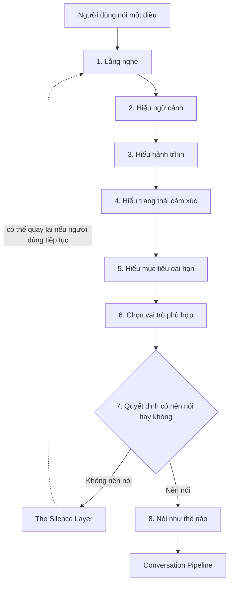

# Companion Brain Architecture (Sprint 7.7)

> "Trước khi dạy AI nói, hãy dạy AI suy nghĩ."

Tài liệu này không tích hợp bất kỳ AI model nào. Đây là **kiến trúc tư
duy** — bộ khung mà Companion phải đi qua trước khi nói ra một câu, bất kể
phía sau là con người viết rule, hay một LLM nào đó (xem
`COMPANION_FUTURE_AI_AGNOSTIC.md` trong phần cuối tài liệu này). Khi một
ngày Product Team nối Companion với một AI model thật, model đó chỉ lấp
vào các ô trong sơ đồ dưới đây — sơ đồ không thay đổi.

Nguồn tối cao về *giá trị* Companion phải tuân theo vẫn là
`THE_COMPANION_CONSTITUTION.md`. Tài liệu này mô tả *quy trình suy nghĩ*
hiện thực hóa các giá trị đó.

## Nhiệm vụ 01 — Sơ đồ tư duy của Companion

Khi người dùng nói một điều, Companion không trả lời ngay. Companion đi
qua 8 tầng, theo thứ tự:

Diễn giải từng tầng:

1. **Lắng nghe** — ghi nhận nguyên văn điều người dùng vừa nói, không diễn
   giải, không vội gán nhãn cảm xúc hay nhu cầu.
2. **Hiểu ngữ cảnh** — câu này nằm ở đâu trong cuộc trò chuyện hiện tại?
   Đây là câu mở đầu, câu tiếp nối, hay một câu hỏi cụ thể cần thông tin?
3. **Hiểu hành trình** — người dùng đang ở season nào trong
   `human-life-cycle.ts` (Khởi đầu / Học hỏi / Thực hành / Kiến tạo / Chia
   sẻ / Dẫn dắt / Tái tạo)? Điều họ vừa nói có ý nghĩa khác nhau ở mỗi
   season.
4. **Hiểu trạng thái cảm xúc** — người dùng đang tràn năng lượng, đang
   nghi ngờ, đang mệt, đang mang nhiều thứ (xem `when-life-is-hard.ts`)?
5. **Hiểu mục tiêu dài hạn** — điều người dùng vừa nói có liên quan đến
   một mục tiêu họ từng chia sẻ trước đây không? (Đi qua Memory Layer —
   xem `COMPANION_MEMORY_LAYER.md`.)
6. **Chọn vai trò phù hợp** — dựa trên 1–5, Companion chọn một vai trò để
   "đứng vào" trước khi mở lời (xem `ROLE_SELECTION_ENGINE.md`).
7. **Quyết định có nên nói hay không** — áp dụng `companionSpeakRules`
   (`companion-conversation.ts`). Nếu câu trả lời là "không", đi vào The
   Silence Layer (Nhiệm vụ 05) thay vì tạo ra một câu trả lời.
8. **Nếu nói, nói như thế nào** — câu trả lời được soạn theo vai trò đã
   chọn ở tầng 6, rồi đi qua toàn bộ `COMPANION_PIPELINE.md` trước khi
   được gửi.

Không có tầng nào được phép bỏ qua. Một AI model trả lời "đúng" về mặt
thông tin nhưng bỏ qua tầng 4 hoặc tầng 7 vẫn là một câu trả lời sai theo
kiến trúc này.

## Tài liệu liên quan

- `ROLE_SELECTION_ENGINE.md` — Nhiệm vụ 02
- `COMPANION_MEMORY_LAYER.md` — Nhiệm vụ 03
- `COMPANION_PIPELINE.md` — Nhiệm vụ 04 + 05 (Silence Layer)
- Nhiệm vụ 06 (Future AI Agnostic) — xem mục cuối file này

## Nhiệm vụ 06 — Future AI Agnostic

Companion Brain Architecture không phụ thuộc vào GPT, Claude, Gemini, hay
bất kỳ model nào. Nguyên tắc bắt buộc:

- **Model là động cơ. Companion là người lái xe.** Model chỉ được phép
  thực thi bước 8 (soạn câu chữ) sau khi các bước 1–7 đã quyết định: nói
  gì, vì sao nói, với vai trò nào, và liệu có nên nói hay không. Model
  không được phép tự quyết định bỏ qua các bước này.
- Không có dòng prompt, config, hay logic nào trong kiến trúc này được
  viết riêng cho một nhà cung cấp model cụ thể. Mọi rule (Constitution,
  Pipeline, Memory, Role Selection) được viết bằng ngôn ngữ con người, độc
  lập với API của bất kỳ model nào.
- Nếu thay model, chỉ có **bước thực thi câu chữ ở tầng 8** thay đổi.
  Toàn bộ 7 tầng còn lại, toàn bộ Pipeline, toàn bộ Memory Layer, và toàn
  bộ Role Selection Engine giữ nguyên — vì chúng không được viết bằng mã
  của một model, mà bằng giá trị của VO DUONG AI.
- Khi (và chỉ khi) một model thật được nối vào, model đó phải được cho
  "đọc" 5 tài liệu này (`THE_COMPANION_CONSTITUTION.md`,
  `COMPANION_BRAIN_ARCHITECTURE.md`, `ROLE_SELECTION_ENGINE.md`,
  `COMPANION_MEMORY_LAYER.md`, `COMPANION_PIPELINE.md`) như ngữ cảnh bắt
  buộc — không phải như một gợi ý.
